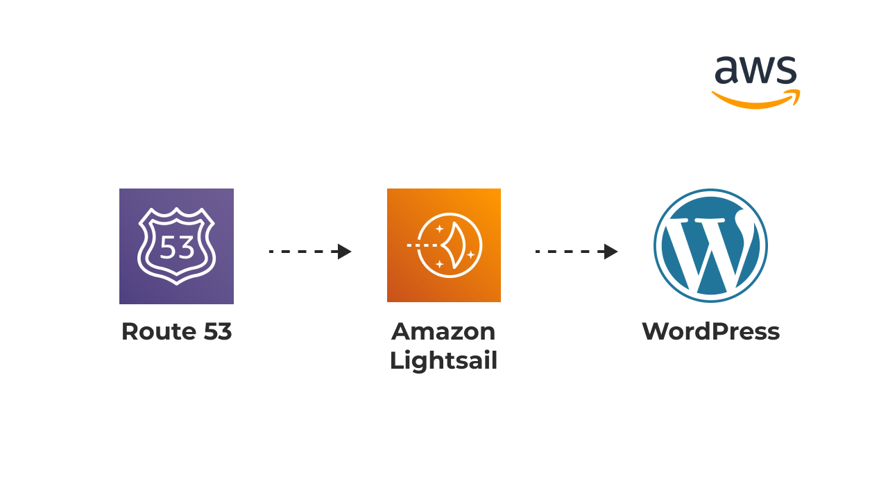

# Host-a-Wordpress-Website-on-AWS-using-Amazon-Lightsail

In this project, I successfully hosted a WordPress website on Amazon Web Services (AWS) using Amazon Lightsail, a cost-effective cloud service, and integrated it with Amazon Route 53 for domain management. This project demonstrates my ability to deploy web applications on AWS and showcases my expertise in utilizing AWS services.

## Project Components

### Amazon Route 53

Amazon Route 53 is a scalable and highly available domain name system (DNS) web service provided by AWS. I utilized Route 53 to manage domain settings, allowing me to associate a custom domain with my WordPress website. This integration provides a professional and branded web presence.

### Amazon Lightsail

Amazon Lightsail is a simplified compute service that provides pre-configured virtual private servers, making it easy to deploy web applications. In this project, I used Lightsail to create and manage the WordPress instance, which offers a budget-friendly solution with easy scalability.

### WordPress

WordPress is a widely-used content management system (CMS) that powers millions of websites worldwide. I set up and configured WordPress on my Lightsail instance, allowing me to create, edit, and manage content easily through the WordPress dashboard.

## Prerequisites

Before embarking on this project, I ensured that I had the following prerequisites in place:

1. An AWS account: I created an AWS account to access and manage AWS services, including Lightsail and Route 53.

2. Basic knowledge of AWS: I acquired a foundational understanding of AWS services and their usage, which enabled me to make informed decisions throughout the project.

3. A domain name: I had a registered domain name ready to be associated with my WordPress website. This allowed me to personalize the web address for my site.

## Project Setup and Configuration

I completed the project by following these key steps:

1. **Domain Configuration with Amazon Route 53:**
   - Set up a hosted zone in Amazon Route 53 for my custom domain.
  
2. **Amazon Lightsail Setup:**
   - Created an Amazon Lightsail instance with the WordPress blueprint.
   - Selected the "$3.50/month" plan for cost-effectiveness.
   - Configured the Lightsail instance with the necessary settings.

3. **WordPress Installation and Configuration:**
   - Accessed the WordPress dashboard setup wizard through the Lightsail instance.
   - Created an admin account and set up website details.
   - Installed and configured plugins and themes as needed for my website.

4. **Configured DNS Settings for Domain Mapping
   - Created DNS records, including an A record pointing to my Lightsail instance's static IP address and a CNAME record for www redirection if needed.

5. **Website Launch:**
   - Accessed my WordPress website using the custom domain.
   - Managed and maintained the website, including regular updates and backups.

## Conclusion

This project showcases my ability to host a WordPress website on AWS using Amazon Lightsail and integrate it with Amazon Route 53 for domain management. The completed project reflects my skills in cloud infrastructure setup, web application deployment, and domain configuration.

Feel free to reach out for any questions or further information about this project.

